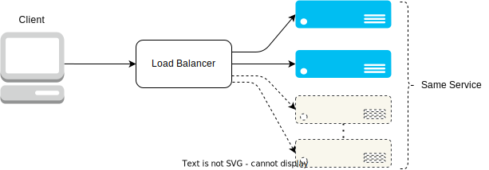

TODO: THIS IS INCOMPLETE

# Load Balancer

Analogy: a Load Balancer is like an Air Traffic Controller

Its used for traffic control

## What its used for

- Directs traffic efficiently across several servers, preventing bottlenecks.
- Used by high-traffic/high-demand websites/serves.

## Real-Life Applications

- Can be used together with API Gateway and Load Balancer for safer and more
efficient client-server communication. TODO: ADD LINK TO API_GATEWAY AND REVERSE_PROXY ARTICLES
