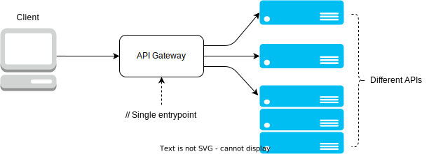

# API Gateway

// TODO: Improve/Complete this analogy
Analogy: an API Gateway is like an Amazon Returns Center. When the mailman picks up
your outgoing return mail, he/she/they do not take it directly to the recipient's
address, despite the item you are returning having the right address written on it. Instead,
the mailman takes it to the post-office, and this letter is then take it to the post-office

Helps organize communication

## What is an API Gateway

- Delivers requests sent by the client to the right backend services.
- Used to simplify and centralize the logistics behind a client communicating
  with several backend services.

## Applications

- Can be used together with API Gateway and Load Balancer for safer and more
  efficient client-server communication. TODO: ADD LINK TO LOAD_BALANCER AND REVERSE_PROXY ARTICLES
