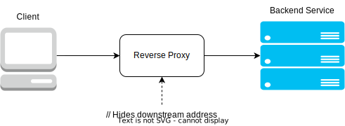

TODO: THIS IS INCOMPLETE

# Reverse Proxy

Its used for stealth

## What it does

Changes the identity of the backend service

- Used to fetch data secretly, while keeping servers hidden from the client.
- Used to mitigate cyber-attacks and eavesdropping in websites that
  send/receive sensitive data to a backend service.

## Real-Life Applications

- Can be used together with API Gateway and Load Balancer for safer and more
  efficient client-server communication. TODO: ADD LINK TO API_GATEWAY AND LOAD_BALANCER ARTICLES
